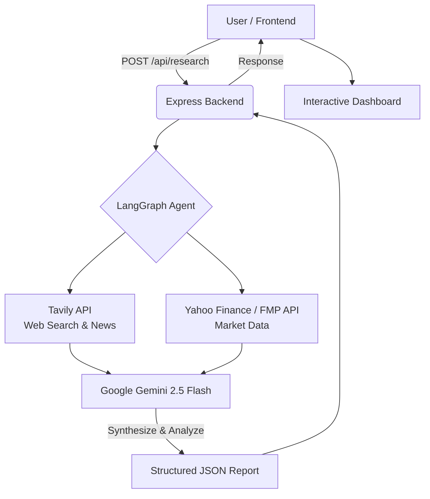

<div align="center">
  

  # 📈 AlphaLens AI
  **AI-Powered Investment Research Platform**

  <p align="center">
    <a href="https://github.com/ShivangChaurasia/AlphaLens/stargazers"></a>
    <a href="https://github.com/ShivangChaurasia/AlphaLens/network/members"></a>
    <a href="https://github.com/ShivangChaurasia/AlphaLens/issues"></a>
    <a href="https://github.com/ShivangChaurasia/AlphaLens/blob/master/LICENSE"></a>
  </p>
</div>

---

## 📖 Project Overview

**AlphaLens AI** is an intelligent, AI-powered investment research platform designed to help retail investors, analysts, and financial enthusiasts make data-driven decisions. By simply entering a company's name or ticker, users receive a comprehensive, explainable AI-generated investment recommendation report.

The application leverages a sophisticated Multi-Agent architecture using **LangGraph**, combining live web search, real-time financial market data, and the reasoning capabilities of **Google Gemini 2.5 Flash** to synthesize vast amounts of financial data into actionable intelligence.

---

## 📑 Table of Contents

- [Features](#-features)
- [Screenshots](#-screenshots)
- [Architecture Overview](#-architecture-overview)
- [Tech Stack](#-tech-stack)
- [How It Works](#-how-it-works)
- [Project Structure](#-project-structure)
- [Installation & Setup](#-installation--setup)
- [Environment Variables](#-environment-variables)
- [Trade-offs & Design Decisions](#-trade-offs--design-decisions)
- [Future Improvements](#-future-improvements)
- [Deployment](#-deployment)
- [Assignment Compliance](#-assignment-compliance)
- [Acknowledgements](#-acknowledgements)

---

## ✨ Features

- **🧠 AI-Powered Investment Research:** Generates a final `INVEST` or `PASS` recommendation based on deep analysis.
- **📊 Financial Analysis & Charting:** View real-time financials and interactive historical price charts (1D, 1W, 1M, 1Y, 5Y, Max).
- **🏢 Company Overview:** Instantly fetches business models, leadership, and industry categorizations.
- **📰 Latest Market News:** Real-time sentiment analysis of the latest headlines regarding the company.
- **🎯 SWOT Analysis:** Auto-generated Strengths, Weaknesses, Opportunities, and Threats breakdown.
- **⚠️ Risk Assessment & Confidence Score:** Quantifies AI certainty and highlights potential investment risks.
- **💎 Beautiful Analytics Dashboard:** A responsive, glassmorphism-inspired UI with Framer Motion micro-animations.
- **⚙️ Configurable AI Pipeline:** Users can seamlessly configure API keys and switch AI models via the settings panel.
- **📄 Explainable AI Reasoning:** Fully transparent chain-of-thought analysis ensuring users understand *why* a recommendation was made.

---

## 📸 Screenshots

| Dashboard View | Financial Analysis |
| :---: | :---: |
|  |  |

*(Note: Replace placeholders with actual application screenshots)*

---

## 🏗️ Architecture Overview

The system uses a Multi-Agent architecture orchestrated by LangGraph, where specialized nodes fetch data, and an LLM synthesizes it.



---

## 💻 Tech Stack

### **Frontend**
- **Framework:** React.js (Vite)
- **Styling:** Tailwind CSS, Glassmorphism UI
- **Animations:** Framer Motion
- **Routing:** React Router DOM
- **Data Visualization:** Recharts
- **Icons:** Lucide React

### **Backend**
- **Environment:** Node.js
- **Framework:** Express.js
- **Architecture:** Serverless-ready Modular API

### **AI & Agents**
- **Orchestration:** LangGraph.js, LangChain.js
- **Large Language Model:** Google Gemini 2.5 Flash / Groq (Llama 3)
- **Web Search:** Tavily Search API
- **Financial Data:** Yahoo Finance API (`yahoo-finance2`) & Financial Modeling Prep (FMP)

---

## ⚙️ How It Works

### **LangGraph Workflow**

The backend utilizes a directed acyclic graph (DAG) to process research requests sequentially:

1. **Company Research Node:** Uses Tavily to scrape the web for the company's business model, leadership, and competitors.
2. **Financial Analysis Node:** Connects to Yahoo Finance to fetch real-time market cap, P/E ratios, revenue growth, and historical trends.
3. **News Collection Node:** Scrapes recent headlines to determine market sentiment.
4. **AI Analysis Node:** Feeds all collected data into Google Gemini to generate a SWOT analysis, confidence score, and investment thesis.
5. **Recommendation:** Outputs a structured JSON object containing a definitive `INVEST` or `PASS` signal.

---

## 📁 Project Structure

```text
AlphaLens-AI/
├── frontend/                  # React Frontend Application
│   ├── api/                   # Backend Express Server (Vercel Serverless)
│   │   ├── agents/            # LangGraph Nodes & AI Logic
│   │   ├── controllers/       # Express Route Controllers
│   │   ├── routes/            # API Endpoints (/api/research, /api/chart)
│   │   └── index.js           # Server Entry Point
│   ├── src/                   # React Source Code
│   │   ├── components/        # Reusable UI Components (StockChart, etc.)
│   │   ├── pages/             # Route Pages (Dashboard, Settings)
│   │   └── index.css          # Tailwind & Global Styles
│   ├── vercel.json            # Deployment Configuration
│   └── package.json           # Unified Dependencies
└── README.md
```

---

## 🚀 Installation & Setup

### **Prerequisites**
- Node.js (v18 or higher)
- npm or yarn
- API Keys for Google Gemini, Tavily, and optionally Groq/FMP.

### **1. Clone the repository**
```bash
git clone https://github.com/ShivangChaurasia/AlphaLens.git
cd AlphaLens
```

### **2. Install Dependencies**
Because the project uses a unified architecture for Vercel, all dependencies (frontend and backend) are in the `frontend` folder.
```bash
cd frontend
npm install
```

### **3. Environment Variables**
Create a `.env` file in the `frontend` directory:
```bash
touch .env
```
Add the following keys:
```env
# AI Models
GEMINI_API_KEY=your_gemini_api_key
GROQ_API_KEY=your_groq_api_key

# Tools
TAVILY_API_KEY=your_tavily_api_key
FMP_API_KEY=your_fmp_api_key
```

### **4. Run Locally**
Start the Vite development server and the Express API proxy simultaneously:
```bash
npm run dev
```
The application will be available at `http://localhost:5173`.

---

## 🔑 Environment Variables Guide

- **`GEMINI_API_KEY`**: Required for the core LLM reasoning. Obtain from [Google AI Studio](https://aistudio.google.com/).
- **`TAVILY_API_KEY`**: Required for live web search and news fetching. Obtain from [Tavily](https://tavily.com/).
- **`FMP_API_KEY`**: (Optional) Financial Modeling Prep API for secondary market data fallback. Obtain from [FMP](https://site.financialmodelingprep.com/).

---

## ⚖️ Trade-offs & Design Decisions

- **Why React & Vite?** Chose Vite over Create-React-App for significantly faster HMR and optimized build sizes. React provides the component-driven architecture necessary for a complex dashboard.
- **Why LangGraph?** Traditional LLM chains are linear. LangGraph allows us to build stateful, cyclical, and modular agent workflows, ensuring if one tool fails (e.g., Yahoo Finance), the AI can gracefully fall back to alternative data sources without crashing.
- **Why Google Gemini 2.5 Flash?** Offers an incredibly large context window and high speed, which is required when feeding dozens of news articles and financial JSON dumps into a single prompt.
- **No Persistent Database:** To keep the architecture stateless and easily deployable via Serverless Functions, user configurations are stored in `localStorage`. 
- **Financial API Constraints:** Relying on free-tier financial APIs means rate limits apply. The app implements deterministic fake-data fallbacks if Yahoo Finance returns a `429 Too Many Requests` error to ensure the UI remains testable during API blocks.

---

## 🔮 Future Improvements

- [ ] **Authentication & User Profiles:** Allow users to save their research history.
- [ ] **Portfolio Tracking:** Let users build a mock portfolio based on AI recommendations.
- [ ] **Database Integration:** Connect to PostgreSQL/MongoDB to cache financial reports and reduce API costs.
- [ ] **PDF Exports:** Add a feature to download the generated investment report as a professional PDF.
- [ ] **Historical Comparisons:** Compare the current AI recommendation against previous quarters.

---

## ☁️ Deployment

This project is configured for seamless Serverless deployment.

**Vercel (Unified Deployment - Recommended)**
The project is structured so that deploying the `frontend` folder to Vercel will automatically host the React app on the Edge network, while simultaneously converting the `frontend/api/` folder into serverless backend functions.
1. Connect your GitHub repo to Vercel.
2. Set the Root Directory to `frontend`.
3. Add your Environment Variables in the Vercel Dashboard.
4. Deploy!

*(Alternative: You can split the codebase and host the Frontend on Vercel and the Backend on Render, though Vercel is recommended to avoid cloud-provider IP blocks from Yahoo Finance).*

---

## 🏆 Assignment Compliance

This project was built to satisfy internship assignment requirements:
- ✔ **Overview:** Included a clear description of the AI-powered investment research concept.
- ✔ **How to Run:** Provided step-by-step local setup instructions.
- ✔ **How It Works:** Documented the LangGraph multi-agent pipeline and architectural flow.
- ✔ **Key Decisions & Trade-offs:** Outlined the reasoning behind the tech stack and stateless design.
- ✔ **Example Runs:** The dashboard seamlessly outputs SWOT, risks, and an INVEST/PASS score.
- ✔ **Future Improvements:** Listed actionable features for subsequent iterations.

---

## 🙏 Acknowledgements

- [Google Gemini](https://deepmind.google/technologies/gemini/) for the incredible LLM reasoning.
- [LangChain & LangGraph](https://www.langchain.com/) for the agentic framework.
- [Tavily](https://tavily.com/) for optimized AI search.
- [Yahoo Finance](https://finance.yahoo.com/) & [Financial Modeling Prep](https://site.financialmodelingprep.com/) for market data.
- [Tailwind CSS](https://tailwindcss.com/) & [Framer Motion](https://www.framer.com/motion/) for the beautiful UI.

---
<p align="center">Made with ❤️ by Shivang Chaurasia</p>
