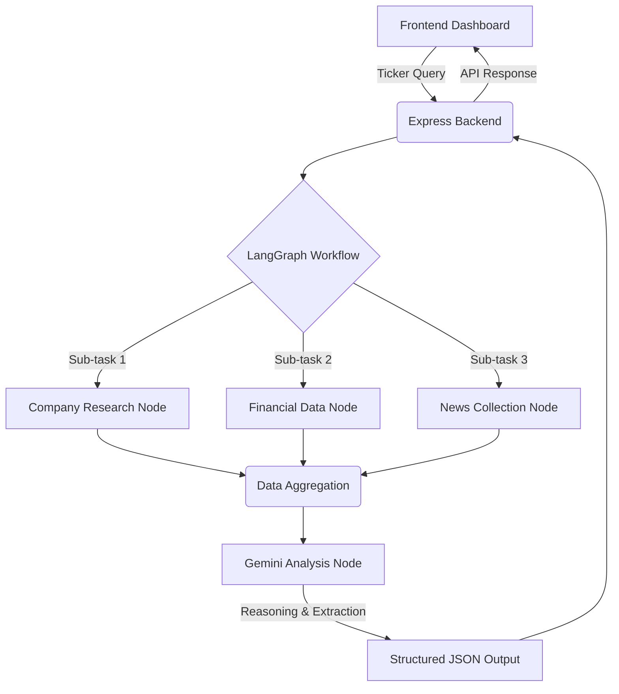

# AlphaLens AI


AlphaLens AI is an advanced, agentic financial research application designed to synthesize complex market data into actionable investment insights.

---

## 1. Overview

**What AlphaLens AI is:**
AlphaLens AI is a full-stack web application powered by a sophisticated AI agent workflow. It automates the exhaustive process of fundamental financial research by aggregating real-time company data, latest news, and financial statements, and synthesizing them into comprehensive investment summaries.

**What problem it solves:**
Retail investors and financial analysts spend hours manually gathering data from fragmented sources (earnings reports, news outlets, financial APIs) to form a cohesive view of a company. AlphaLens AI solves this by deploying an autonomous AI agent to do the heavy lifting—researching, analyzing, and structuring the data into an easy-to-digest dashboard in seconds.

**How the AI agent works:**
The core of AlphaLens AI is a directed acyclic graph (DAG) workflow built with LangGraph. When a user requests an analysis for a stock ticker, the agent dynamically orchestrates specialized sub-tasks: it queries financial APIs for fundamental metrics, searches the web for recent news and sentiment, and feeds all collected context into a Large Language Model (LLM). The LLM then reasons over the data and outputs a structured JSON response containing recommendations, confidence scores, and risk/strength assessments.

**Main technologies used:**
- **Frontend:** React, Tailwind CSS
- **Backend:** Node.js, Express.js
- **AI / Agentic Framework:** LangGraph (JS/TS), Google Gemini Pro
- **Data Providers:** Tavily (Web Search), Financial Modeling Prep (Financial Data)

---

## 2. How to Run It

Follow these instructions to get AlphaLens AI running on your local machine.

### Prerequisites
- [Node.js](https://nodejs.org/) (v18 or higher)
- [npm](https://www.npmjs.com/) or [yarn](https://yarnpkg.com/)
- API Keys for Gemini, Tavily, and Financial Modeling Prep (FMP)

### Required APIs & Where to Obtain Them
1. **`GEMINI_API_KEY`**: Obtain from Google AI Studio ([Get Key](https://aistudio.google.com/)).
2. **`TAVILY_API_KEY`**: Obtain from Tavily for AI web search ([Get Key](https://tavily.com/)).
3. **`FMP_API_KEY`**: Obtain from Financial Modeling Prep for stock data ([Get Key](https://site.financialmodelingprep.com/)).

### Repository Setup

Clone the repository to your local machine:

```bash
git clone https://github.com/YourUsername/AlphaLens.git
cd AlphaLens
```

### Environment Variables

Navigate to the `backend` directory and create a `.env` file:

```bash
cd backend
touch .env
```

**Example `.env` file:**

```env
PORT=3001
GEMINI_API_KEY=your_gemini_api_key_here
TAVILY_API_KEY=your_tavily_api_key_here
FMP_API_KEY=your_fmp_api_key_here
```

### Backend Installation & Running

From the `backend` directory, install dependencies and start the server:

```bash
# Install dependencies
npm install

# Start the Express server
npm run start
# Or for development: npm run dev
```
The backend should now be running on `http://localhost:3001`.

### Frontend Installation & Running

Open a new terminal window, navigate to the `frontend` directory, install dependencies, and start the React app:

```bash
cd ../frontend

# Install dependencies
npm install

# Start the React development server
npm run start
# Or if using Vite: npm run dev
```
The frontend should now be running on `http://localhost:3000` (or the port specified by your bundler).

---

## 3. How It Works

AlphaLens AI employs a robust, agentic architecture to ensure comprehensive data collection and accurate analysis.

### Architecture Flow



### The Stages Explained

1. **Frontend Request:** The user inputs a stock ticker (e.g., "AAPL") into the React dashboard.
2. **Express Backend:** The backend receives the request and initializes the LangGraph agent state.
3. **LangGraph Workflow:** The graph orchestrates the execution of several specialist nodes concurrently or sequentially based on dependencies.
4. **Company Research:** Fetches basic company profile information.
5. **Financial Data:** Reaches out to the FMP API to pull recent income statements, balance sheets, and key financial ratios.
6. **News Collection:** Uses the Tavily API to perform a targeted web search for the latest news articles and market sentiment regarding the company.
7. **Gemini Analysis:** All collected raw data is injected into a prompt for Google's Gemini model. The prompt instructs the LLM to act as a senior financial analyst, synthesizing the data.
8. **Structured JSON:** Gemini is constrained to output its analysis in a strict JSON format (using structured outputs/function calling) to ensure reliable parsing.
9. **Frontend Dashboard:** The backend sends the JSON payload back to the frontend, which renders the data into beautiful charts, summaries, and recommendation widgets.

---

## 4. Key Decisions & Trade-offs

Building a production-ready AI application requires balancing performance, development speed, and complexity.

### Technical Choices
- **Why React?** Provides a robust component-based architecture for building a dynamic, interactive dashboard that updates seamlessly as analysis results stream in.
- **Why Express?** A lightweight and unopinionated backend framework perfect for serving as a proxy and orchestrator for our AI workflows without unnecessary boilerplate.
- **Why LangGraph?** Traditional sequential chains break down on complex tasks. LangGraph allows us to define the research process as a stateful graph, enabling cyclical reasoning, parallel data fetching, and robust error handling.
- **Why Gemini?** Offers a massive context window (essential for reading multiple financial reports and news articles simultaneously) and excellent native JSON structured output capabilities.
- **Why Tailwind CSS?** Enables rapid UI prototyping with utility classes, keeping styling co-located with components and ensuring a consistent design system.
- **Why no database?** For the MVP, the focus was on real-time agentic research rather than data persistence. The architecture is stateless, which drastically simplifies deployment.
- **Why Tavily?** Optimized specifically for AI agents, Tavily returns clean, parsed text from web pages rather than just raw HTML or URLs, reducing token usage and parsing logic.
- **Why Financial Modeling Prep?** Provides comprehensive, institutional-quality financial data with developer-friendly REST APIs.

### Trade-offs
- **No persistent storage:** Because there is no database, users cannot save their historical analyses or build persistent watchlists. Every query is a fresh run.
- **API dependency:** The application is entirely dependent on third-party APIs remaining highly available. Rate limits on free tiers can cause research workflows to fail.
- **Limited financial coverage on free plans:** Niche stocks or deep historical data might be inaccessible without paid API subscriptions.
- **AI recommendations are informational:** LLMs can hallucinate or misinterpret financial nuance. The system is designed as a research assistant, not a definitive financial advisor.

---

## 5. Example Runs

Here is a glimpse of what the structured analysis output looks like for various prominent companies.

### Example 1: Tata Consultancy Services (TCS)
- **Recommendation:** **BUY**
- **Confidence:** 88%
- **Executive Summary:** TCS continues to demonstrate robust operational resilience and strong deal momentum in the IT services sector. Despite macro-economic uncertainties impacting discretionary tech spending globally, TCS's large-scale transformational engagements and cost-optimization capabilities for clients have supported stable margins. The company is actively scaling its GenAI offerings and cloud migration services.
- **Key Risks:** Global macroeconomic slowdown affecting client IT budgets, currency fluctuations, and intensifying attrition or wage inflation in the tech talent pool.
- **Key Strengths:** Industry-leading margins, highly diversified client base across geographies and verticals, and strong cash generation capabilities.

### Example 2: Pine Labs (Private)
- **Recommendation:** **HOLD**
- **Confidence:** 72%
- **Executive Summary:** Pine Labs is a leading merchant commerce platform in Asia, expanding aggressively beyond its core PoS terminal business into online payments, Buy Now Pay Later (BNPL), and issuing services. While revenue growth has been strong, the company continues to invest heavily in expansion and acquisitions to build a comprehensive fintech ecosystem, which keeps profitability muted in the near term.
- **Key Risks:** Intense competition in the Indian fintech and payments landscape, regulatory changes regarding BNPL and digital lending, and potential challenges in integrating recent acquisitions.
- **Key Strengths:** Massive merchant network, strong backing from top-tier institutional investors, and successful diversification into high-margin software and financial services.

### Example 3: Reliance Power (RPOWER)
- **Recommendation:** **SELL**
- **Confidence:** 85%
- **Executive Summary:** Reliance Power has faced significant historical challenges related to high debt burdens and stalled infrastructure projects. While recent debt restructuring efforts and capital infusions have provided some breathing room, the company's core operational profitability remains weak compared to industry peers. The transition towards renewable energy is slow, leaving it exposed to legacy thermal power issues.
- **Key Risks:** High leverage and potential liquidity constraints, regulatory challenges in tariff realization, and the broader industry shift away from coal-based power generation.
- **Key Strengths:** Large portfolio of operating power assets and recent successful debt settlement agreements with lenders reducing immediate financial stress.

---

## 6. What I Would Improve With More Time

While AlphaLens AI demonstrates a powerful agentic workflow, there are several areas for enhancement to reach enterprise-grade maturity:

| Feature | Why it was excluded | How it would be implemented |
| :--- | :--- | :--- |
| **Database & Authentication** | Prioritized core AI agent logic for the MVP. | Integrate PostgreSQL with Prisma ORM and NextAuth/Clerk to allow users to save analyses, create accounts, and manage API usage. |
| **Watchlists & Portfolio Tracking** | Requires persistent storage and user accounts. | Build a dashboard component that periodically runs lightweight background checks on saved tickers. |
| **Caching Layer** | Minimizing infrastructure overhead. | Implement Redis. Financial statements update quarterly, making them perfect candidates for caching to reduce API costs and latency. |
| **Streaming Responses** | Increases backend complexity (SSE/WebSockets). | Use LangChain's streaming capabilities and Server-Sent Events to stream the LLM's thought process and partial JSON to the UI, improving perceived performance. |
| **Multiple LLM Providers** | Focused on optimizing prompts for a single model (Gemini). | Abstract the LLM interface to allow users to select between Anthropic Claude, OpenAI GPT-4o, and Gemini based on preference or cost. |
| **Agent Memory** | Short-term workflow didn't require conversational context. | Implement LangGraph's checkpointer (e.g., using SQLite) so the agent remembers previous questions a user asked about a specific stock. |
| **PDF Exports** | UI/UX was prioritized over document generation. | Integrate a library like `puppeteer` or `jsPDF` to generate polished, printable teardown reports directly from the dashboard. |
| **Competitor Benchmarking** | Expanding the DAG to handle 3-5 companies simultaneously increases latency and token limits significantly. | Create a dedicated "Comparison Node" in LangGraph that fetches data for a target company and its top two peers, prompting the LLM to generate a comparative matrix. |
| **Historical Stock Analysis** | Focus was on real-time agentic research and fundamental data synthesis. | Incorporate charting libraries (e.g., Chart.js or Recharts) in the frontend and connect to historical price endpoints via the FMP API. |
| **More Financial Indicators** | Kept the scope to key fundamental metrics (balance sheet, income statement) to limit context window size. | Implement additional financial formulas on the backend and integrate them as new nodes in the LangGraph workflow. |

---

*AlphaLens AI was developed as a submission for an AI Product Engineering internship, showcasing modern full-stack development combined with advanced agentic LLM workflows.*
